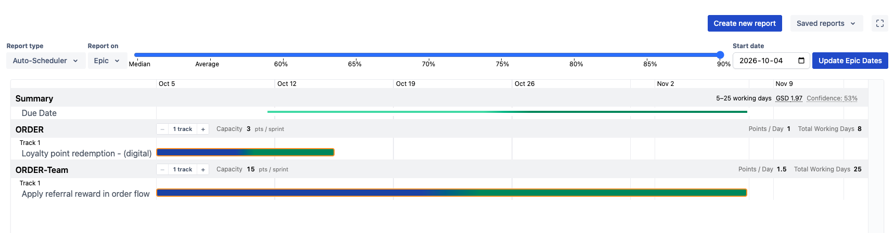
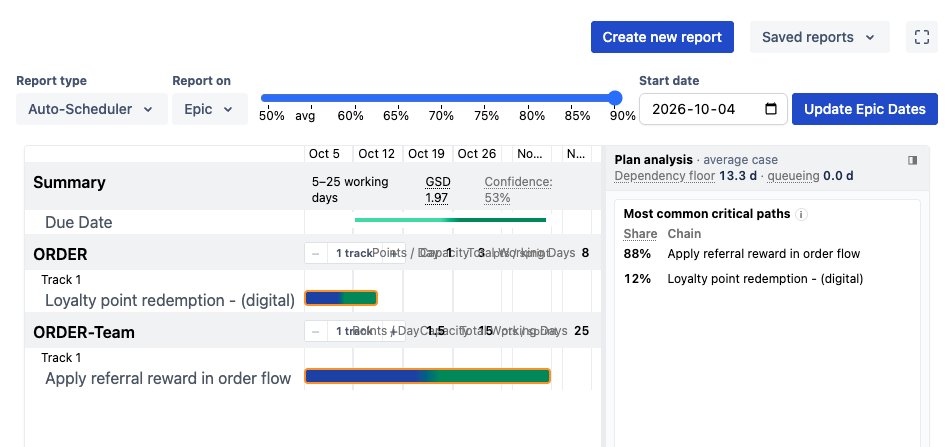

# Auto-Scheduler Narrow-Width Layout — Implementation Plan

> **For agentic workers:** REQUIRED SUB-SKILL: Use superpowers:subagent-driven-development (recommended) or superpowers:executing-plans to implement this plan task-by-task. Steps use checkbox (`- [ ]`) syntax for tracking.

## Context

With the settings sidebar or another panel open, the Auto-Scheduler's usable width drops to roughly 940px and the report degrades badly:

- The confidence slider's nine tick labels collide (`50% avg 60% 65%…`).
- The team header's grey row paints its two halves on top of each other — `1 traPoints / DapacityTo3al Working Days 8`.
- The Gantt bars get less horizontal space than the issue names beside them: ~290px of labels against ~290px of timeline.
- Date headers degrade to `No…` / `N…`.

| Full width                                     | Squeezed by a sidebar panel                                 |
| ---------------------------------------------- | ----------------------------------------------------------- |
|  |  |

None of this is caused by the viewport shrinking — it is caused by sibling panels taking width. That rules out `md:`/`lg:` breakpoints and points at container queries, which are already available (`@tailwindcss/container-queries`, `tailwind.config.js:87`) but unused anywhere in `src/`.

**Goal:** make the Auto-Scheduler legible at ~600–950px of report width, by giving the bars a guaranteed share of the space, letting the crowded rows wrap, and moving the slider onto its own line.

## Global Constraints

- **New UI must be React.** Never add a CanJS UI component (`.github/copilot-instructions.md`).
- **Prettier:** single quotes, 120 print width, 2-space indent. `npx prettier --write <paths>` before every commit.
- **TypeScript strict.** `npm run typecheck` must pass.
- **Tests are colocated** `*.test.ts` / `*.test.tsx`. Single file: `npx vitest run <path>`.
- **Tailwind JIT needs literal class strings** — no interpolated class names, or the CSS is never generated.
- **`npm run dev:css` must be running** (or `npm run dev`) for new Tailwind classes to appear. The container-query variants are new to this repo; if a class appears to do nothing, check `dist/production.css` for it before debugging the markup.
- This is a **layout-only** pass. No changes to the scheduler, the simulation, or any copy.

---

## Background the implementer needs

### The four root causes

**1. The label column is `auto`.** `AutoScheduler.tsx:330`:

```js
gridTemplateColumns: `[what] auto repeat(${gridData.gridNumberOfDays}, 1fr)`;
```

`auto` sizes to content up to the `max-w-sm` (384px) cap on the label cells (`IssueSimulationRow.tsx:77`, `AutoScheduler.tsx:617`). The `1fr` day columns absorb 100% of any width loss.

**2. `1fr` day columns have no floor**, so the grid never scrolls horizontally — it just compresses. The grid element is already `overflow-auto` (`AutoScheduler.tsx:328`); nothing ever asks it to scroll.

**3. The crowded rows cannot wrap.** `AutoScheduler.tsx:543` is `flex items-center justify-between gap-4` holding two `inline-flex … whitespace-nowrap` spans. Flex shrinks both below their content width, but `whitespace-nowrap` means the text overflows its box instead of wrapping — hence the overlap rather than a clean clip. Same shape at `AutoScheduler.tsx:413` (the Summary row's estimate + GSD + Confidence).

**4. `#report-controls` is a non-wrapping flex row.** `TimelineReport.tsx:254` — `className="app-chrome-hidden flex gap-1"`. `ReportControlsWrapper` and `AutoSchedulerControls` are both fragments, so the report-type select, issue-type select, slider, date picker and button are all **direct children of that one row**. The slider cannot be moved to its own line from inside `AutoSchedulerControls` alone.

### Why `fit-content()` instead of a container query for the label column

`fit-content(40%)` as a grid track means _"content-sized, but never more than 40% of the grid's inline size"_ — exactly the rule wanted, with the percentage resolving against the grid container's content box (the scrollport), not the overflowing content. No container, no `cqi`, no JS. Only the controls bar genuinely needs a container query, because there the decision depends on a sibling's width rather than on content.

### Why the per-day floor is computed in JS

A CSS-only floor would have to be per-column, so a 120-day plan would force ~1700px of horizontal scroll on a wide screen — a regression. `gridNumberOfDays` is already in hand in JS, so dividing a fixed total by it gives a floor that is constant regardless of plan length.

### Existing things to reuse

- `gridLayer` (`src/react/reports/AutoScheduler/z-layers.ts`) — the paint-order registry. Add to it; do not hardcode a `z-`.
- `TeamCapacityControls.stories.tsx` already mimics the grey row (`Row`, with `max-w-[1080px]`). Parametrising its width is the cheapest way to see the wrap fix without Jira credentials.
- `UncertaintySlider.tsx:22-33` already has a `ResizeObserver` that swaps `Median`/`Average` → `50%`/`avg` below 400px. **Leave it alone** — once the slider has its own full-width row it is ~900px wide in the broken case, and the existing tier still covers genuinely tiny widths.

---

## File structure

| File                                                                            | Change                                                           |
| ------------------------------------------------------------------------------- | ---------------------------------------------------------------- |
| `spec/035-narrow-autoscheduler-styling/plan.md`                                 | This plan, committed into the repo                               |
| `src/react/TimelineReport/TimelineReport.tsx`                                   | `#report-controls` becomes a wrapping container-query container  |
| `.../ReportControls/components/AutoSchedulerControls/AutoSchedulerControls.tsx` | Slider cell gets the responsive order/width wrapper              |
| `src/react/reports/AutoScheduler/AutoScheduler.tsx`                             | Track sizing, day-column floor, pinned label cells, row wrapping |
| `src/react/reports/AutoScheduler/IssueSimulationRow.tsx`                        | Pinned label cell                                                |
| `src/react/reports/AutoScheduler/z-layers.ts`                                   | New `labelColumn` layer                                          |
| `.../components/TeamCapacityControls/TeamCapacityControls.tsx`                  | Outputs span wraps instead of overflowing                        |
| `.../components/TeamCapacityControls/TeamCapacityControls.stories.tsx`          | New narrow story                                                 |

---

### Task 0: Land the plan

- [x] **Step 1:** Create `spec/035-narrow-autoscheduler-styling/` and write this file to `spec/035-narrow-autoscheduler-styling/plan.md`.
- [x] **Step 2:** Drop the two screenshots into `spec/035-narrow-autoscheduler-styling/` as `before-wide.png` and `before-squished.png` (sources: `~/Desktop/Screenshot 2026-09-22 at 6.25.20 PM.png` and `…6.25.44 PM.png`) and link them from the Context section.
- [ ] **Step 3:** `git add spec/035-narrow-autoscheduler-styling && git commit -m "docs(autoscheduler): plan for narrow-width layout"`

---

### Task 1: Confidence slider onto its own line

The bar wraps, and below a threshold the slider is ordered last and forced full width so it takes a row of its own. Applied to `#report-controls` for **all** report types — other bars only gain the ability to wrap when they already overflow, so nothing moves unless it was already broken.

- [ ] **Step 1: Make the controls bar a wrapping container**

`src/react/TimelineReport/TimelineReport.tsx:254`:

```diff
-<div id="report-controls" className="app-chrome-hidden flex gap-1">
+<div id="report-controls" className="app-chrome-hidden flex flex-wrap gap-x-1 gap-y-2 @container/controls">
```

`@container/controls` emits `container-type: inline-size`, which implies `contain: layout style inline-size`. That makes the bar a containing block for `position: fixed` descendants. The two selects use `@atlaskit/dropdown-menu`, which portals to `body`, so they are unaffected — but Step 4 verifies it rather than assuming.

- [ ] **Step 2: Give the slider a responsive cell**

`AutoSchedulerControls.tsx` — wrap `<UncertaintySlider />`:

```jsx
{
  /* Below the threshold the bar cannot hold the slider and the selects on one line, so the
     slider takes a row of its own. Container-, not viewport-, relative: the squeeze comes from
     a sidebar panel opening, not from the window resizing. */
}
<div className="flex order-last w-full @[1000px]/controls:order-none @[1000px]/controls:w-auto @[1000px]/controls:flex-1">
  <UncertaintySlider uncertaintyWeight={uncertaintyWeight} onChange={setUncertaintyWeight} />
</div>;
```

Leave `UncertaintySlider`'s own root (`relative flex flex-grow px-2 items-end`) untouched.

- [ ] **Step 3: Tune the threshold in the browser**

`1000px` is an estimate: the non-slider cells measure ~560px together and the slider needs ~420px to show nine ticks. Open the Auto-Scheduler, drag the sidebar open and closed, and move the number until the slider drops to its own line just before the ticks start colliding.

- [ ] **Step 4: Verify no report's controls regressed**

With `npm run dev`, switch through every report type (auto-scheduler, gantt/default, table, flow-metrics, time-in-status, estimation-progress, estimate-analysis, report-of-reports) at both wide and squished widths and confirm: the bar looks unchanged when it fits, every dropdown still opens in the right place, and nothing is clipped.

- [ ] **Step 5: Typecheck, format, commit**

```bash
npx prettier --write src/react/TimelineReport src/react/ReportControls
npm run typecheck
git commit -am "fix(autoscheduler): drop the confidence slider to its own row when the controls bar is narrow"
```

---

### Task 2: Prioritise the bars — cap the labels, floor the timeline

**Tasks 2 and 3 land in one commit.** The floor is what introduces horizontal scrolling, and Task 3 is what keeps that scrolling usable.

- [ ] **Step 1: Add the floor constant**

Near the top of `AutoScheduler.tsx`, beside the other module constants:

```ts
/**
 * The timeline never compresses below this, however narrow the report gets — past it the grid
 * scrolls horizontally instead. A total rather than a per-column minimum: a per-column floor would
 * force a 120-day plan to scroll on a screen that fits it today.
 */
const MIN_TIMELINE_WIDTH = 480;
```

- [ ] **Step 2: Rewrite the track sizing**

`AutoScheduler.tsx:330`:

```diff
-gridTemplateColumns: `[what] auto repeat(${gridData.gridNumberOfDays}, 1fr)`,
+// `fit-content(40%)`: the labels size to their content but never take more than 40% of the grid,
+// so the bars stop losing every pixel a panel takes. The day columns carry a minimum that adds up
+// to `MIN_TIMELINE_WIDTH` whatever the plan's length — below that the grid scrolls (see the pinned
+// label column, which is what keeps that scroll readable).
+gridTemplateColumns: `[what] fit-content(40%) repeat(${gridData.gridNumberOfDays}, minmax(${
+  MIN_TIMELINE_WIDTH / gridData.gridNumberOfDays
+}px, 1fr))`,
```

Keep `max-w-sm` on the label cells — it still caps the column on wide screens, where 40% is the larger of the two limits.

- [ ] **Step 3: Confirm the geometry**

At ~1700px of report width the layout should be indistinguishable from today. At ~580px the labels should cap near 230px, the timeline should hold 480px, and a horizontal scrollbar should appear on the grid. Check that the dependency arrows still land on the right bars after scrolling — `svg-blockers.ts:54` measures against `svg.getBoundingClientRect()`, so it should be scroll-safe, but confirm rather than assume.

---

### Task 3: Pin the label column

Once the grid scrolls sideways, unpinned names scroll out of view and the rows lose their identity.

- [ ] **Step 1: Add the layer**

`z-layers.ts`, between `row` and `teamHeaderBackground`:

```ts
/**
 * The pinned `what` column. Above the bars and the day-column rules, which slide under it when the
 * grid is scrolled sideways; below the team header, whose own name cell is pinned on both axes.
 */
labelColumn: 32,
```

- [ ] **Step 2: Pin every `what`-column cell**

Each needs `sticky left-0`, `zIndex: gridLayer.labelColumn`, and an opaque background matching the band it sits on:

| Cell                          | Location                                                          | Background                                   |
| ----------------------------- | ----------------------------------------------------------------- | -------------------------------------------- |
| Issue name                    | `IssueSimulationRow.tsx:77`                                       | `bg-white`                                   |
| Issue name (`SimulationData`) | `AutoScheduler.tsx:617`                                           | `bg-white`                                   |
| `Track N`                     | `AutoScheduler.tsx`, the `pl-4 flex pt-0.5 pr-1` cell             | `bg-white`                                   |
| `Summary`                     | `AutoScheduler.tsx`, the `pl-2 pt-2 pb-1 pr-1 flex` cell          | `bg-neutral-20`                              |
| Team name                     | `TeamHeaderRow`, already `sticky top-0` at `gridLayer.teamHeader` | already has `bg-neutral-20` / `bg-[#fff3eb]` |

The team-name cell only needs `left-0` added — it becomes sticky on both axes and its existing layer already sits above `labelColumn`.

- [ ] **Step 3: Verify the pin**

Squeeze the report until the grid scrolls, then scroll right: names stay put, bars and column rules pass underneath them with nothing bleeding through, the team band stays opaque, and the dirty-team amber treatment still reads correctly.

- [ ] **Step 4: Typecheck, format, commit**

```bash
npx prettier --write src/react/reports/AutoScheduler
npm run typecheck
npx vitest run src/react/reports/AutoScheduler
git commit -am "fix(autoscheduler): give the timeline a width floor and pin the label column"
```

---

### Task 4: Let the crowded rows wrap

- [ ] **Step 1: The team header's grey row**

`AutoScheduler.tsx:543` — add `flex-wrap` and split the gap:

```diff
-className="pl-0 pt-1.5 pb-1 pr-3 text-xs flex items-center justify-between gap-4 relative"
+className="pl-0 pt-1.5 pb-1 pr-3 text-xs flex flex-wrap items-center justify-between gap-x-4 gap-y-1 relative"
```

`justify-content` applies per line, so this needs no container query and no second tier: when both halves fit they stay spread apart exactly as today; when they don't, the outputs drop to a second line and left-align under the inputs. The row's height is `auto` and the `bg-neutral-20` backing div spans the same grid row, so the band grows with it.

- [ ] **Step 2: Let the outputs half wrap internally**

`TeamCapacityControls.tsx`, `TeamCapacityOutputs` — its two children are `whitespace-nowrap`, so at very narrow widths they overflow rather than wrap:

```diff
-<span className="inline-flex items-center gap-3.5">
+<span className="inline-flex min-w-0 flex-wrap items-center gap-x-3.5 gap-y-1">
```

- [ ] **Step 3: The Summary row's metadata**

`AutoScheduler.tsx:413` has the same shape — `flex flex-row-reverse gap-2` holding `PlanSpreadSummary` and the estimate text. Add `flex-wrap` and `gap-y-1`. Because the row is reversed, check the wrapped result by eye: if the two lines read in a confusing order, drop `flex-row-reverse` for `justify-end` instead. **This step is optional** — the Summary row is cramped but not broken today, so drop it if it costs more than a minute.

- [ ] **Step 4: A narrow story for the grey row**

`TeamCapacityControls.stories.tsx` — its `Row` hardcodes `max-w-[1080px]` and mimics the real row's classes, so it must be updated to match Step 1's classes or the story stops proving anything. Parametrise the width and add:

```jsx
/** The squeezed case: the outputs drop to a second line instead of painting over the inputs. */
export const Narrow: StoryObj<typeof Row> = { args: { width: 420 } };
```

- [ ] **Step 5: Typecheck, test, format, commit**

```bash
npx prettier --write src/react/reports/AutoScheduler
npm run typecheck
npx vitest run src/react/reports/AutoScheduler
git commit -am "fix(autoscheduler): wrap the team header and summary rows instead of overlapping them"
```

---

## Verification

**Storybook** (no Jira credentials needed) — `npm run storybook`, open `reports/AutoScheduler/TeamCapacityControls`:

1. `Clean` is unchanged from today.
2. `Narrow` shows `Points / Day` / `Total Working Days` on a second line, left-aligned, with no overlapping glyphs.

**The real app** — `npm run dev`, load a plan with at least two teams, then open the settings sidebar to reproduce the squeeze from the screenshots:

1. The controls bar shows `Report type · Report on · Start date · Update Epic Dates` on line 1 and the full-width slider on line 2, with all nine ticks legible.
2. No text in the grey team rows overlaps at any width from full to ~600px.
3. The bars hold at least 480px of timeline; below that the grid scrolls horizontally rather than compressing further.
4. Scrolled right, the issue names stay pinned at the left edge and everything else passes under them.
5. Date headers still read (`Oct 19`, `Nov 2`) rather than `No…` / `N…` — the floor should fix this as a side effect. If it does not, see the first deferred item.
6. Dependency arrows connect the right bars, before and after horizontal scrolling.
7. Editing capacity, stepping tracks, and `Reset` / `Commit` all still work in the wrapped row.
8. Opening and closing the plan-analysis rail, and dragging its divider, behaves as before.
9. At full width the report is visually identical to `before-wide.png`.

## Definition of done

- [ ] `npm run typecheck` passes.
- [ ] `npm run test` passes with no new failures.
- [ ] `npx prettier --check src/react/reports/AutoScheduler src/react/ReportControls src/react/TimelineReport` passes.
- [ ] All nine app checks and both Storybook checks above pass.
- [ ] Every other report type's controls bar is unchanged at full width and no dropdown mispositions.
- [ ] The plan is committed at `spec/035-narrow-autoscheduler-styling/plan.md` with both screenshots.

## If the above is not enough

In rough value order. Each is independent — pick up only what the verification pass shows is still needed.

1. **Width-aware date-header granularity.** `bestFitRanges(startDate, endDate, 12)` (`AutoScheduler.tsx:660`) hardcodes 12 buckets regardless of width, which is why headers truncate to `No…`. Pass a derived `maxBuckets` (`≈ timelineWidth / 90`) and `bestFitRange` switches weekly → monthly on its own, with no truncation logic to write.
2. **Let the rail yield before the Gantt does.** `CriticalPathRail.tsx:103` is `shrink-0` at a 260–560px width, so the Gantt currently absorbs the entire deficit. Either clamp the rail to a fraction of the container, or auto-collapse it to the spine below a threshold — if auto-collapsing, do it once per threshold crossing and never re-open on widening, or it will fight a user who deliberately closed it.
3. **Float the rail as an overlay when narrow.** Below ~800px there is no room for a Gantt and a 260px panel side by side; a drawer over the grid keeps both usable.
4. **Tooltip on truncated labels.** Show the full summary on hover, gated on `scrollWidth > clientWidth` so unbroken rows do not sprout tooltips.
5. **Collapse the Summary row's metadata.** `GSD 1.97` and `Confidence: 53%` become a single `ⓘ` with the detail in a tooltip, leaving only `5–25 working days` visible.
6. **Hide `Track 1` when a team has one track.** It is a whole row and a chunk of label column spent on no information — both teams in the screenshots are single-track.
7. **Swap the summary for the issue key at extreme widths.** `ORDER-123` stays fully legible where a 12-character truncation of a sentence does not. Last resort.
8. **A second compact tier in `UncertaintySlider`.** Only if the slider still crowds on its own row: drop to three ticks (50 / 70 / 90) and put the live value in a bubble at the thumb.

## Deliberately out of scope

- No changes to the scheduler, the Monte Carlo, or any user-facing copy.
- No responsive behaviour driven by viewport breakpoints — the squeeze is a panel, not the window.
- No rewrite of `UncertaintySlider`'s existing `ResizeObserver` into a container query. It works, and consistency is not worth the churn in this pass.
- `.report-elements { container-type: size }` (`src/css/status-reports.css:341`) is dead — nothing applies that class. Leave it; deleting it is unrelated cleanup.
- No persistence of anything new (rail width, wrap state) to the URL or saved reports.
